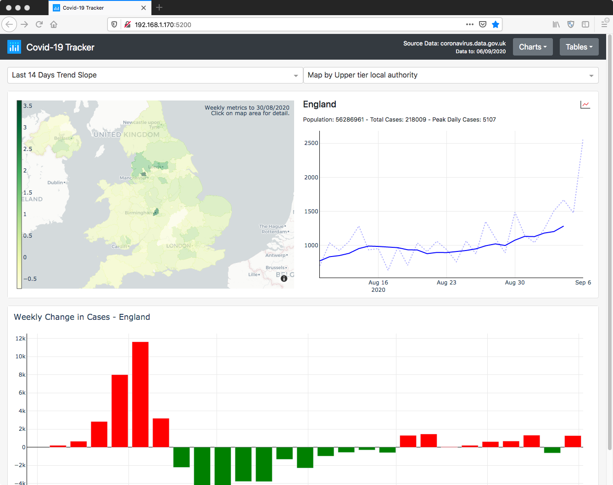

# UK Covid-19 Tracker

Application to track UK Covid-19 cases, tests and deaths.  Developed in Python, using the following :

| | |
|-|-|
|Pandas & Numpy|Data processing, aggregation, filtering and stats calculations|
|Plotly & Dash|Presentation layer with dashboards, maps, charts and tables|
|Flask & Gunicorn|Web application server|
|Apache Spark|Parallel data collection and processing|
|Redis|Data storage & application cache|
|Docker|Containers for reverse proxy (Nginx), cache (Redis) and the main application (Flask)|
|Selenium|Automated testing|
|Azure DevOps|Code Repository & automated pipeline deployment|

## Link
  
[http://mrvm1.uksouth.cloudapp.azure.com/](http://mrvm1.uksouth.cloudapp.azure.com/)
   

   
## Data
  
Covid 19 data sourced from https://coronavirus.data.gov.uk API (see https://coronavirus.data.gov.uk/developers-guide).

Geojson mapping data sourced from the UK Office for National Statistics - www.ons.gov.uk.  

Data is loaded daily within an hour of the government publishing new data sets (usually late afternoon).
   

   
Cases Data is available by Nation, English Region, and local authority.

Testing, Deaths and Hospital data available by Nation.
   
